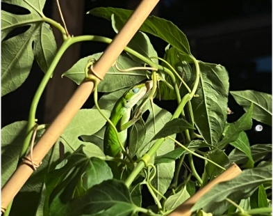

class: center, middle

# Light-Seeking Gecko ASIC

## A simple biology inspired microcontroller design

Author: Donaldo Almazan

Fab Futures Microelectronics - Spring 2026

https://futures.academany.org/classes/microelectronics/

---

# About Me

My name is Donaldo Almazan - I’m an artist, engineer, and maker based in Houston, TX. I’m passionate about open-source hardware, decentralized technology, and public science.

I work on the Community Systems Working Group (CSWG), a maker-collective focused on developing decentralized community infrastructure & tooling

https://cswg.infrastructures.org/

In my sparetime I enjoy gardening and projects intersecting art & science.

.center[]

---

# Inspiration

## BEAM Robotics

Originated by Mark Tilden in the late 1980s and early 1990s these are simple, analog, biologically inspired machines. BEAM stands for Biology, Electronics, Aesthetics, and Mechanics, these robots often use analog 'neural networks' instead of microcontrollers to mimic insect-like behavior.

.center[
<iframe width="560" height="300" src="https://www.youtube-nocookie.com/embed/3RKTKfLhuPE?si=SsA8ZJBfCGeT5qx-" title="YouTube video player" frameborder="0" allow="accelerometer; autoplay; clipboard-write; encrypted-media; gyroscope; picture-in-picture; web-share" referrerpolicy="strict-origin-when-cross-origin" allowfullscreen></iframe>
]

---

# Project Idea

Goal: design a **simple chip controller for a light-seeking robot**

Inspired by:

* BEAM robotics
* solar-powered photovores
* simple biological locomotion

Concept:

Two light sensors determine motion direction.
The chip generates **gait patterns** that make the robot crawl toward the light.


---

# System Concept

```
                                        Solar Panel
                                            |
                                            v
                                Solar Engine (Capacitor)
                                            |
                                            v
                                    +----------------+
                                    |   Gecko Chip   |
              Left Photoresistor -> |                | <- Right-Photoresistor 
                    Input           | Direction +    |          Input
                                    | Gait Control   |
                                    +--------+-------+
                                            |
                                            v
                                        4 Leg
                                        Outputs
```

System components:

* Solar panel (power source) & Solar engine / capacitor circuit
* Two photoresistors
* Gecko controller chip
* Four LED outputs representing legs

The chip acts as the **behavior controller**.

---

# Chip Inputs and Outputs

Inputs:

| Signal           | Description        |
| ---------------- | ------------------ |
| `clk`            | system clock       |
| `rst`            | reset              |
| `left_brighter`  | left light sensor  |
| `right_brighter` | right light sensor |

Outputs:

| Signal      | Description        |
| ----------- | ------------------ |
| `leds[3:0]` | gait / leg outputs |


---

# Behavior Logic

## LED mapping:

FL = Front Left, RL = Rear Left, FR = Front Right, RR = Rear Right

FL (3)     FR (1)

RL (2)     RR (0)

---
# Behavior Logic

## Truth Table

Sensor inputs determine movement modes.

| left_brighter | right_brighter | behavior     |
| ---- | ----- | ------------ |
| 0    | 0     | stop         |
| 1    | 0     | turn left    |
| 0    | 1     | turn right   |
| 1    | 1     | move forward |

---

## Example sequences:

Turn left

```
0001
0010
0001
0010
```

Turn right

```
0100
1000
0100
1000
```

Forward gait

```
1001
0000
0110
0000
```

---

# Block Diagram

```
left_brighter ----\
                   -- > Direction Logic ----\
right_brighter ---/                          \
                                              > Motion Mode
clk ------------------------------------------> State Counter
rst ----------------------------------------/

                     State
                       |
                       v
                Gait Pattern Decoder
                       |
                       v
                 FL RL FR RR (LEDs)
```
The state machine:

* cycles through gait phases
* freezes when robot is idle
* outputs patterns depending on sensor input

---

# RTL Design

Core module & test bench implemented in **Verilog** using help of ChatGPT

`gecko.v`:

```verilog
module gecko (
    input  wire       clk,
    input  wire       rst,
    input  wire       left_brighter,
    input  wire       right_brighter,
    output reg  [3:0] leds
);

    // 4-phase gait state
    reg [1:0] state;

    // LED bit positions:
    // leds[3] = FL = Front Left
    // leds[2] = RL = Rear Left
    // leds[1] = FR = Front Right
    // leds[0] = RR = Rear Right
    localparam FL = 3;
    localparam RL = 2;
    localparam FR = 1;
    localparam RR = 0;

    // Freeze state while standing still (00)
    always @(posedge clk) begin
        if (rst) begin
            state <= 2'd0;
        end else if (left_brighter || right_brighter) begin
            state <= state + 2'd1;
        end
    end

    always @(*) begin
        leds = 4'b0000;

        case ({left_brighter, right_brighter})
            // 00: no light -> stand still
            2'b00: begin
                leds = 4'b0000;
            end

            // 10: left light brighter -> turn left
            // right side alternates
            2'b10: begin
                case (state)
                    2'd0: leds[RR] = 1'b1; // 0001
                    2'd1: leds[FR] = 1'b1; // 0010
                    2'd2: leds[RR] = 1'b1; // 0001
                    2'd3: leds[FR] = 1'b1; // 0010
                endcase
            end

            // 01: right light brighter -> turn right
            // left side alternates
            2'b01: begin
                case (state)
                    2'd0: leds[RL] = 1'b1; // 0100
                    2'd1: leds[FL] = 1'b1; // 1000
                    2'd2: leds[RL] = 1'b1; // 0100
                    2'd3: leds[FL] = 1'b1; // 1000
                endcase
            end

            // 11: both bright -> forward gait
            // alternate diagonal pairs with pauses
            2'b11: begin
                case (state)
                    2'd0: begin
                        leds[FL] = 1'b1;
                        leds[RR] = 1'b1;   // 1001
                    end
                    2'd1: leds = 4'b0000;  // 0000
                    2'd2: begin
                        leds[RL] = 1'b1;
                        leds[FR] = 1'b1;   // 0110
                    end
                    2'd3: leds = 4'b0000;  // 0000
                endcase
            end
        endcase
    end

endmodule
```

---

# RTL Test Bench

Core module & test bench implemented in **Verilog** using help of ChatGPT

`gecko_tb.v`:
```verilog
`timescale 1ns/1ps

module gecko_tb;

    reg clk;
    reg rst;
    reg left_brighter;
    reg right_brighter;
    wire [3:0] leds;

    gecko uut (
        .clk(clk),
        .rst(rst),
        .left_brighter(left_brighter),
        .right_brighter(right_brighter),
        .leds(leds)
    );

    // 10 ns clock period
    always #5 clk = ~clk;

    initial begin
        $dumpfile("wave.vcd");
        $dumpvars(0, gecko_tb);

        clk = 0;
        rst = 1;
        left_brighter = 0;
        right_brighter = 0;

        // reset
        #12;
        rst = 0;

        // 00: stand still
        #40;

        // 10: turn left
        left_brighter = 1;
        right_brighter = 0;
        #40;

        // 00: stand still again, state frozen
        left_brighter = 0;
        right_brighter = 0;
        #30;

        // 01: turn right
        left_brighter = 0;
        right_brighter = 1;
        #40;

        // 11: forward gait
        left_brighter = 1;
        right_brighter = 1;
        #40;

        // 00: stop
        left_brighter = 0;
        right_brighter = 0;
        #20;

        $finish;
    end

endmodule
```

---

# Simulation

The design was then verified using Terminal commands to execute an Icarus Verilog simulation and open GTKWave

```bash
iverilog -o sim gecko_tb.v gecko.v
vvp sim
gtkwave wave.vcd
```

Testbench drives sensor inputs and clock.

Expected behaviors:

* idle when both sensors off
* left / right turning sequences
* forward gait when both sensors active

---

## Waveform Analysis

.center[]

---

# ASIC Design Flow

The design followed the full digital ASIC pipeline:

1. RTL design (`gecko.v`)
2. Simulation and linting
3. Logic synthesis (Yosys)
4. Place & Route (OpenROAD)
5. Layout generation
6. GDS export

Flow automated with a **Makefile pipeline** provided in our container. 

(This was a LIFESAVER!)

With ChatGPT I generated a modified Makefile to run the ASIC pipeline on my gecko.v design.

---

## Troubleshooting build

When I attempted to run `make build` I recieved an error:

`[ERROR PDN-0185]`

It seems OpenROAD was building a PDN (Power Delivery Network) grid size too big for my projects core to fit onto.

My design is very small, so the default power-grid recipe from the example flow was oversized for the core. I adjusted the floorplan to give the PDN enough area for place-and-route.

I modified `flow/pnr.tcl` and `lib/constraints.sdc` then successfully ran the build! 🥳

---

# Layout Result

.center[]

Outputs produced:

* synthesized netlist, DEF layout, and a final **GDS file** ready for fabrication

---

## Layout Closeup

.center[]

---

## Layout Pinout

.center[]

---

## Future Work

### Exploring different gait patterns
* breadboard different options & test out in larger scale 
* determining if there is a best gait for given environment (smooth, rocky, verticle)
* possibly add a button to toggle between different patterns

.center[]

---

## Future Work

### Gecko-like adhesive pads for climbing
* Stanford 'micro-tug' explored use of gecko-inspired adhesive
* I was able to find a similar commerical product, I'd like to test how well it could perform


https://www.discovermagazine.com/microtug-robot-pulls-objects-2-000-times-its-weight-11330

---

## Future Work

### Exploring flexible PCBs & PCB actuators


https://www.youtube.com/channel/UCdxTCCRnQgfi2vr2fZupYIQ
https://electronoobs.com/PCB_prototype41.php

---

## Lessons Learned

Key takeaways:

* RTL design translates directly into physical hardware
* synthesis maps logic into standard cells
* place-and-route builds the actual chip layout
* the full ASIC flow can be automated with open-source tools

---

# Credits

- Community Systems Working Group, Workshop Template: https://github.com/ciwg/workshop-YYYY-MM-DD-template/
- Google Fonts: Bitcount and Bitcount Single
- Fab Futures Microelectronics Course: https://futures.academany.org/classes/microelectronics/

---

class: center, middle

# Thank You!
