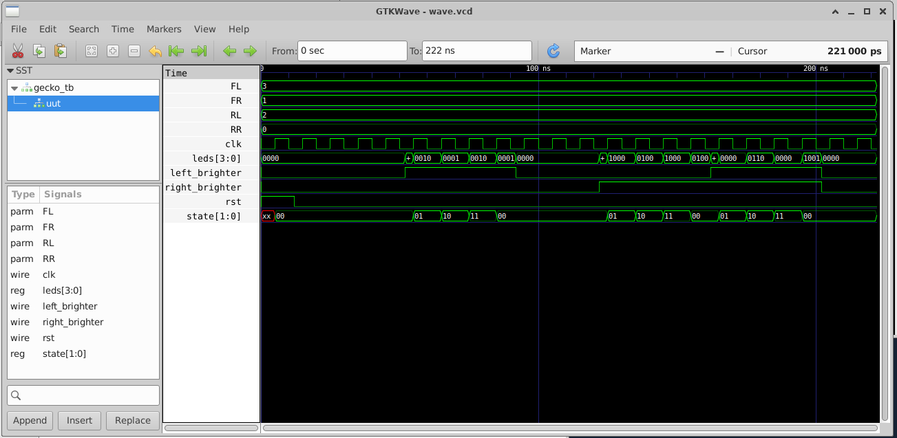
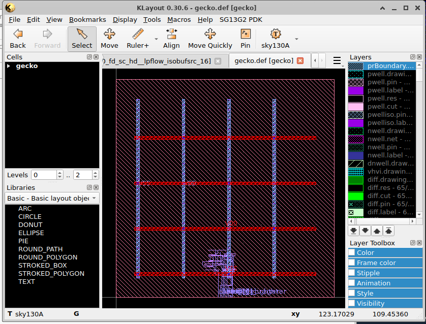
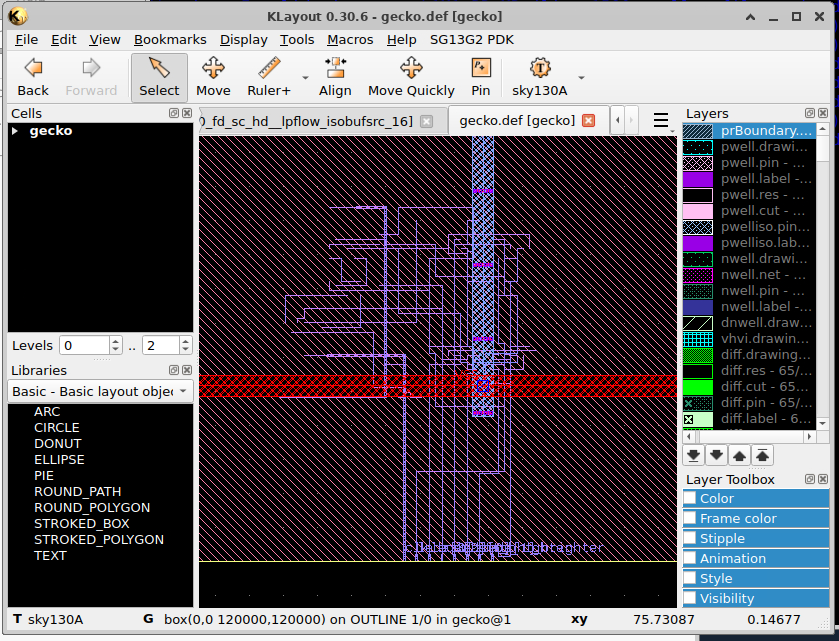
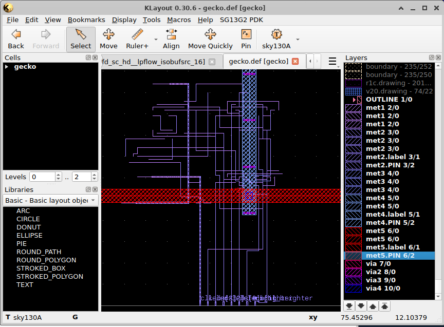
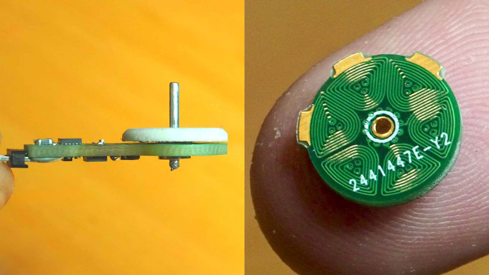
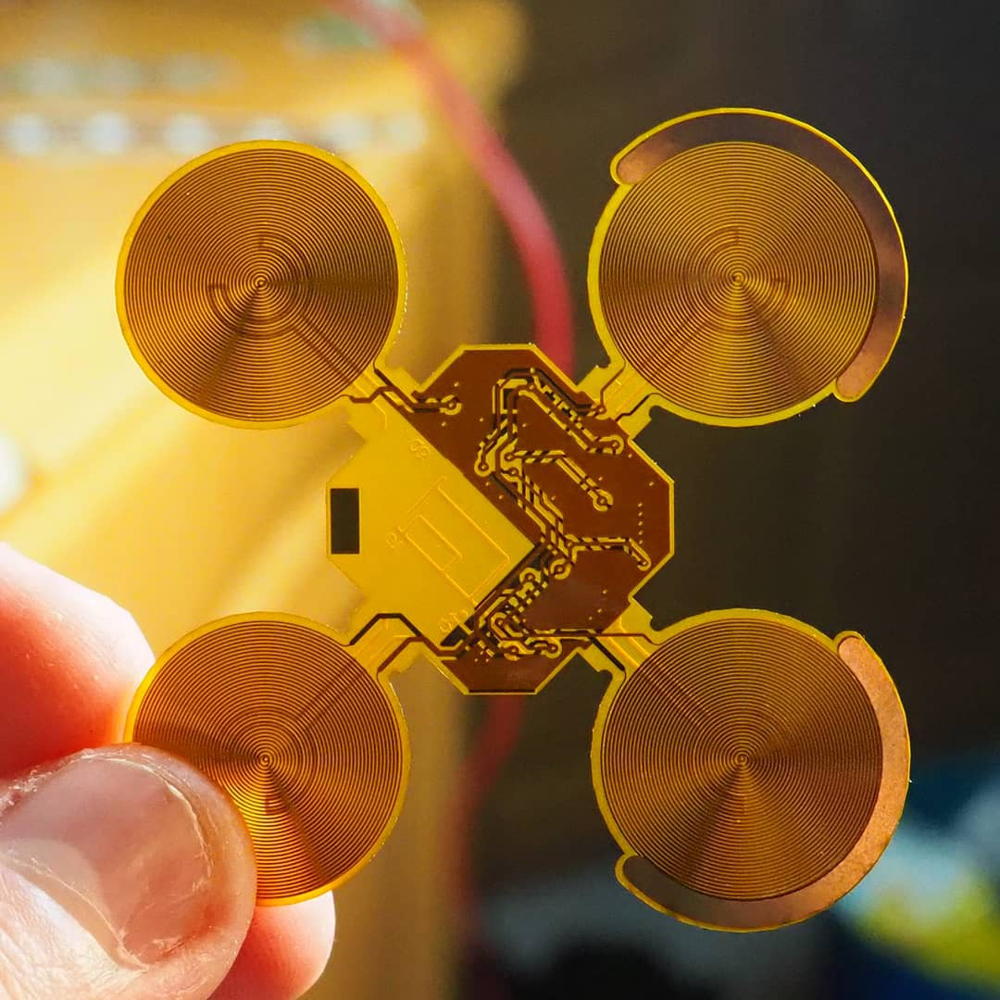
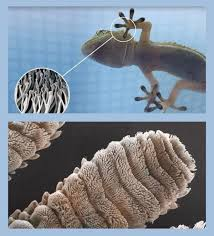
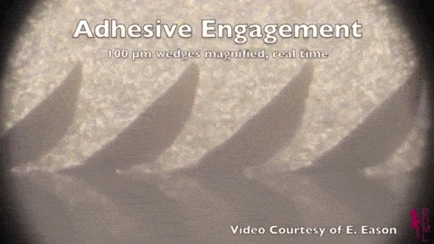
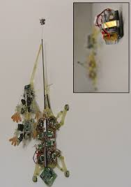

class: center, middle

# Light-Seeking Gecko ASIC

## A simple biology inspired microcontroller design

Author: Donaldo Almazan

Fab Futures Microelectronics - Spring 2026

https://futures.academany.org/classes/microelectronics/

---

# About Me

My name is Donaldo Almazan - I’m an artist, engineer, and maker based in Houston, TX. I’m passionate about open-source hardware, decentralized technology, and public science.

I work on the Community Systems Working Group (CSWG), a maker-collective focused on developing decentralized community infrastructure & tooling

https://cswg.infrastructures.org/

In my sparetime I enjoy gardening and intersecting art & science

---

# Testing Columns
## Two Column Slide

<table style="width:100%">
<tr>
<td>

### Left

- point 1  
- point 2  
- point 3  

</td>

<td>

### Right

```go
fmt.Println("hello")
```

---

# Project Idea

Goal: design a **simple chip controller for a light-seeking robot**

Inspired by:

* BEAM robotics
* solar-powered photovores
* simple biological locomotion

Concept:

Two light sensors determine motion direction.
The chip generates **gait patterns** that make the robot crawl toward the light.

---

# System Concept

```
                                        Solar Panel
                                            |
                                            v
                                Solar Engine (Capacitor)
                                            |
                                            v
                                    +----------------+
                                    |   Gecko Chip   |
              Left Photoresistor -> |                | <- Right-Photoresistor 
                    Input           | Direction +    |          Input
                                    | Gait Control   |
                                    +--------+-------+
                                            |
                                            v
                                        4 Leg
                                        Outputs
```

System components:

* Solar panel (power source)
* Solar engine / capacitor circuit
* Two photoresistors
* Gecko controller chip
* Four LED outputs representing legs

The chip acts as the **behavior controller**.

---

# Chip Inputs and Outputs

Inputs:

| Signal           | Description        |
| ---------------- | ------------------ |
| `clk`            | system clock       |
| `rst`            | reset              |
| `left_brighter`  | left light sensor  |
| `right_brighter` | right light sensor |

Outputs:

| Signal      | Description        |
| ----------- | ------------------ |
| `leds[3:0]` | gait / leg outputs |


---

# Behavior Logic

LED mapping:

FL = Front Left, RL = Rear Left, FR = Front Right, RR = Rear Right

FL (3)     FR (1)

RL (2)     RR (0)

## Truth Table

Sensor inputs determine movement modes.

| left_brighter | right_brighter | behavior     |
| ---- | ----- | ------------ |
| 0    | 0     | stop         |
| 1    | 0     | turn left    |
| 0    | 1     | turn right   |
| 1    | 1     | move forward |

---

## Example sequences:

Turn left

```
0001
0010
0001
0010
```

Turn right

```
0100
1000
0100
1000
```

Forward gait

```
1001
0000
0110
0000
```

---

# Block Diagram

```
left_brighter ----\
                   -- > Direction Logic ----\
right_brighter ---/                          \
                                              > Motion Mode
clk ------------------------------------------> State Counter
rst ----------------------------------------/

                     State
                       |
                       v
                Gait Pattern Decoder
                       |
                       v
                 FL RL FR RR (LEDs)
```

---

# RTL Design

Core module implemented in **Verilog**

Example snippet:

```verilog
always @(posedge clk) begin
  if (rst)
    state <= 0;
  else if (left_brighter || right_brighter)
    state <= state + 1;
end
```

The state machine:

* cycles through gait phases
* freezes when robot is idle
* outputs patterns depending on sensor input

---

# Simulation

Design verified using:

* Icarus Verilog
* GTKWave

Testbench drives sensor inputs and clock.

Expected behaviors:

* idle when both sensors off
* left / right turning sequences
* forward gait when both sensors active

---

## Waveform Analysis

.center[]

---

# ASIC Design Flow

The design followed the full digital ASIC pipeline:

1. RTL design (`gecko.v`)
2. Simulation and linting
3. Logic synthesis (Yosys)
4. Place & Route (OpenROAD)
5. Layout generation
6. GDS export

Flow automated with a **Makefile pipeline** provided in our container. 

(This was a LIFESAVER!)

With ChatGPT I generated a modified Makefile to run the ASIC pipeline on my gecko.v design.

---

## Troubleshooting build

When I attempted to run `make build` I recieved an error:

`[ERROR PDN-0185]`

It seems OpenROAD is building a PDN (Power Delivery Network) grid size too big for my projects core to fit onto.

My design is very small, so the default power-grid recipe from the example flow was oversized for the core. I adjusted the floorplan to give the PDN enough area for place-and-route.

---

# Layout Result

.center[]

Outputs produced:

* synthesized netlist, DEF layout, and a final **GDS file**

The GDS represents the final chip geometry ready for fabrication flow, although I'd like to refine the design further before attempting Tiny Tapeout.

---

## Layout Closeup

.center[]

---

## Layout Pinout

.center[]

---

## Future Work

### Exploring different gait patterns
* breadboard different options & test out in larger scale 
* determining if there is a best gait for given environment (smooth, rocky, verticle)
* possibly add a button to toggle between different patterns


---

## Future Work

### Exploring flexible PCBs & PCB actuators





https://www.youtube.com/channel/UCdxTCCRnQgfi2vr2fZupYIQ
https://electronoobs.com/PCB_prototype41.php

---

## Future Work

### Gecko-like adhesive pads for climbing
* Stanford 'micro-tug' explored use of gecko-inspired adhesive
* I was able to find a similar commerical product, I'd like to test how well it could perform






https://www.discovermagazine.com/microtug-robot-pulls-objects-2-000-times-its-weight-11330

---

## Lessons Learned

Key takeaways:

* RTL design translates directly into physical hardware
* synthesis maps logic into standard cells
* place-and-route builds the actual chip layout
* the full ASIC flow can be automated with open-source tools

---

# Credits

- Community Systems Working Group, Workshop Template: https://github.com/ciwg/workshop-YYYY-MM-DD-template/
- Google Fonts: Bitcount and Bitcount Single
- Fab Futures Microelectronics Course: https://futures.academany.org/classes/microelectronics/

---

class: center, middle

# Thank You!

---

# Slide with Footnote

Some content that deserves a note.<sup>[1]</sup>

<div class="footnote">
[1] This note stays near the bottom of the slide. <br>
[2] You'll need to include a line break between each footnote.
</div>

Footnotes will be positioned at the bottom of the slide regardless if they are in-between two text blocks.<sup>[2]</sup>
